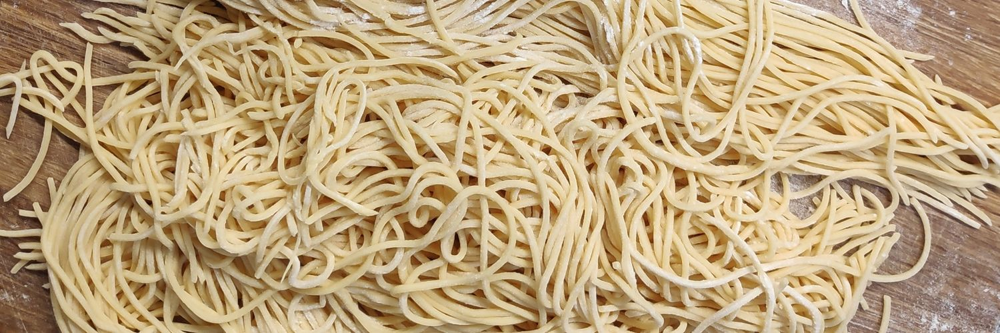

Contrary to what this blog says, I also have things other than pasta on my mind. Some of these things will go into this blog. These thoughts are the thoughts of a person, who was raised and socialized in southern Germany but lives in Berlin since 2011. 

Having learned my basic scientific education at Technische Universität Berlin (aerospace engineering), I realized early on how important it is for me to view my engineering activities in a broader sociocultural context. My time at HPI School of Design Thinking further sharpened my personal perspective on the (mostly) wonderful world we are living in. And as long as I can read Roger Willemsen's books, I am grateful for each day on Earth.

Feel free to reach out on my on Twitter ([@niphiwi](https://twitter.com/niphiwi) or [LinkedIn](https://www.linkedin.com/in/nicolas-p-winkler-12356790/).

To learn something about my pasta, bread or croissants, please visit my Instagram ([@brotbubi](https://www.instagram.com/brotbubi/)).
